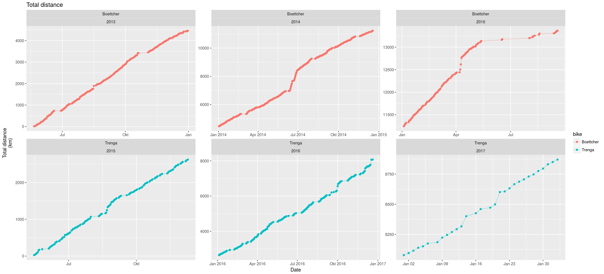

# fahrrad

A little script to collect my bicycling statistics & plot some graphs.

Data is collected in a csv file. [R](http://www.r-project.org/) is used to read
this file and to create plots.

## CSV file *stats.csv*

* columns: bike (a name for your bike), date, kilometers on that day, time on
  that day, V mean (average speed), V max (max speed), total kilometers, total
  time
* separator is ','
* date format dd.MM.yyyy
* time format HH:mm:ss

## Required R packages:

1. [lubridate](https://github.com/hadley/lubridate) for datetime stuff
2. [ggplot2](http://ggplot2.org/) for plotting

## Usage

To plot your own statistics, just run `make`. Several plots will be created in
the current folder. My (semi-current) plots are included here.

sample:

Have fun!
